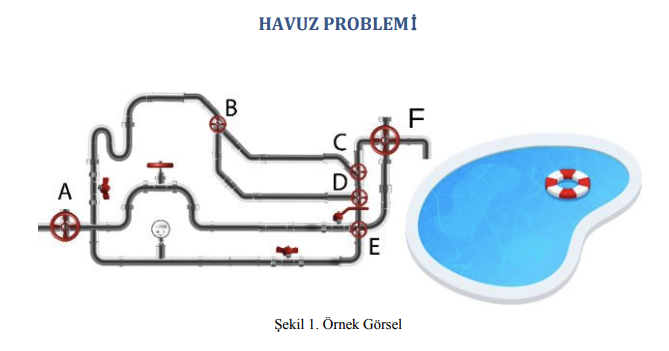
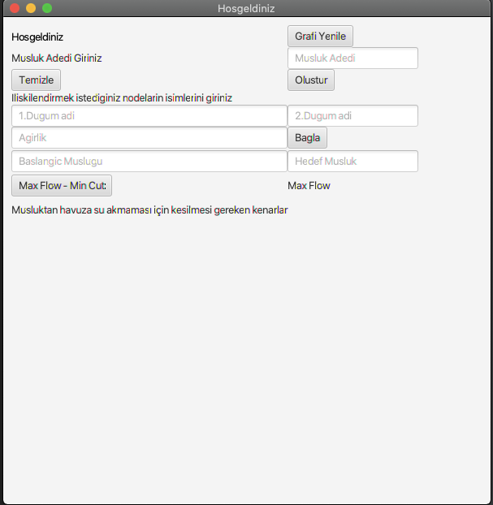
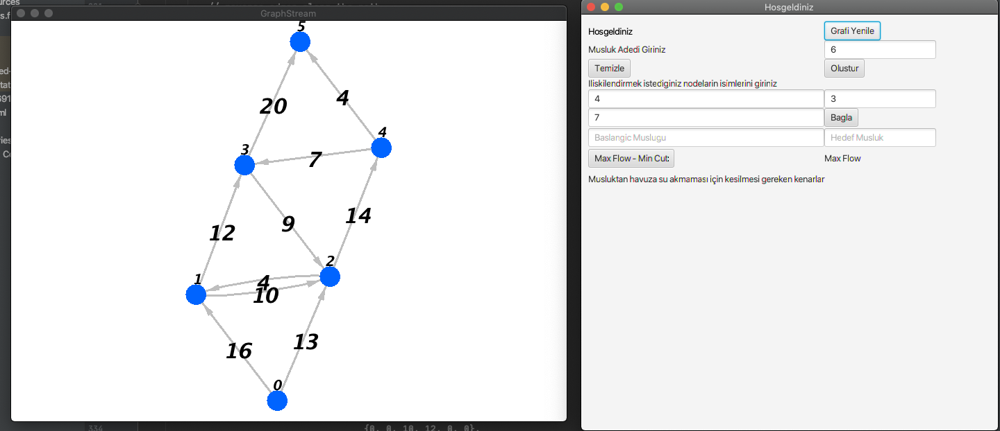
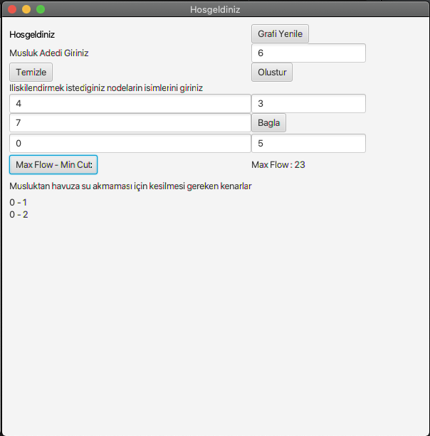
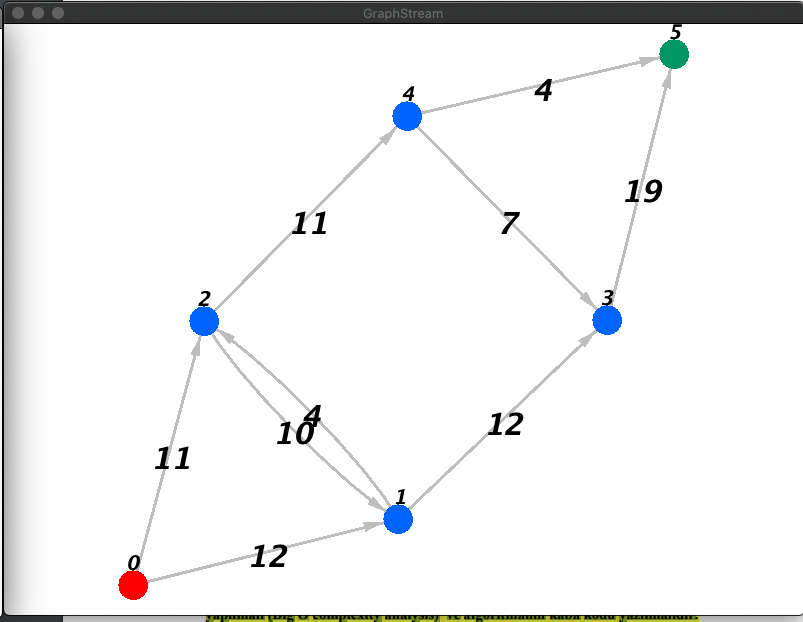
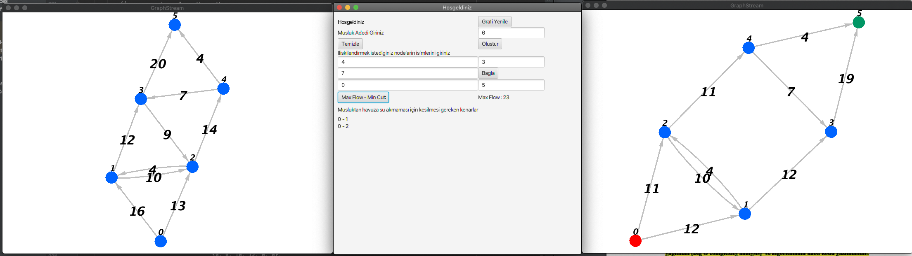

# max-flow-min-cut-with-graph

Bu projede, literatürde azami akış ( maximum flow ) olarak geçen ve düğümler (nodes) arasında akış
kapasiteleri belirli bir şekildeki (graph) bir başlangıçtan bir hedefe en fazla akışın sağlandığı
problemleri çözmeniz beklenmektedir. Devamında ise akışın sistemden geçmemesi için literatürde
min-cut olarak geçen yöntemi uygulamanız beklenmektedir.
Buradaki düğümler muslukları/vanaları, düğümler arasındaki kenarlar (edges) ise musluklar
arasındaki boru hatlarının kapasitesini belirtsin. Her bir kenar, kenarın izin verebileceği maksimum
akış limiti olan ayrı bir kapasiteye sahiptir.

Amacımız A düğümünden F düğüme (daha fazla ya da az miktarda düğüm olabilir değerler örnek
olarak verilmiştir) azami miktarda akış sağlayabilmektir.

1. İsterler
Arayüz üzerinden kullanıcıdan,

● Musluk sayısı (node/düğüm),

● Musluk arasında bağlantı bilgisini veren boru hattı (edge/kenar)

● Ve boru hatlarının kapasiteleri alınacaktır.
Alınan bilgilere göre bir graf yapısı dinamik olarak gösteren bir arayüz hazırlamanız beklenmektedir.
Projenizin çalışma adımları:
1. Kullanıcı havuzu doldurmaya başlayacak olan, başlangıç düğümünü seçecektir.
2. Geliştirdiğiniz algoritma havuzu maksimum kapasitede dolduracak yolu bulacaktır. Görsel
olarak bunu göstermeniz beklenmektedir.
3. Daha sonraki aşamada ise musluktan havuza su akmaması için kesilmesi gereken en az sayıda
kenar tespiti yapılacaktır. Kesilmesi gereken kenarların hangi noktalar arasında olduğu da
yazılmalıdır.

###İsterler doğrultusunda oluşturulan ekran;

####Kullanıcıdan ilk etapta musluk sayısı istenmekte bu bu musluk sayısına göre dinamik bir graf oluşturulur.
####Ardından kullanıcı hangi muslukları/düğümleri birbirine bağlamak istiyorsa 1 ve 2 dugum adı alanlarına girerek ağırlık değeri vermesi gerekmektedir.

###Girilen değerler sonucu oluşan graf yapısı;

####Grafımız oluştuktan sonra kullanıcının başlangıç ve hedef düğümü girip Max Flow - Min Cut butonuna basması gerekmektedir.
###Sonuçlar ekranda görülecektir;

